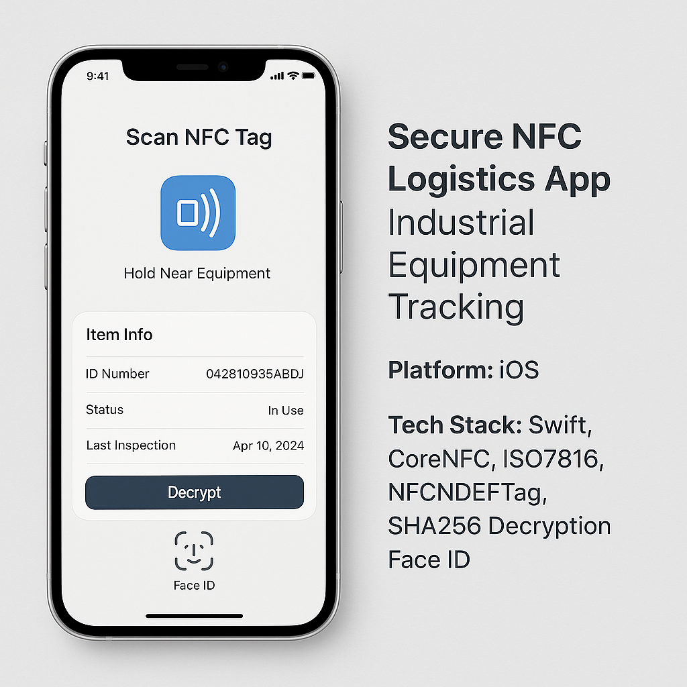

## 👋 Hi, I’m Arjun  
### SwiftUI & AI/ML Specialist  | Mobile Application Developer

I build high-performance iOS apps & AI-powered solutions using **Swift, SwiftUI, Python, AWS**.  
Here are some of my featured projects 👇  

---
## 🎬 Featured Projects

| Project | Preview | Description |
|---------|---------|-------------|
| **NFC Tag Reader App** |  | Secure NFC reader app (ISO7816 + NFCNDEFTag protocols) with SHA-256 decryption in Swift. |
| **Salon Booking Web App** |  | Full-stack web app for salon appointments + loyalty offers & client engagement. |
| **AI Automation Tool** |  | Python + AI tool that uploads Zoom recordings to Google Drive, generates a summary. |
| **WatchOS SwiftUI Demo** |  | SwiftUI WatchOS app showcasing interactive UI and iPhone sync. |

---

## 🧠 Skills & Expertise  
**Languages:** Swift, SwiftUI, Objective-C, Python, Kotlin, Flutter
**Frameworks/Tools:** CoreML, Vision, ARKit, AWS, Firebase, RevenueCat, Plaid, Stripe, PayPal, API Integration  
**Services:** iOS App Development, AI/ML Solutions, Payment Gateway Integration, MVP/POC Development  

---

## 🤖 AI Tools & Productivity

I’m an early adopter of AI-powered development workflows — using tools that accelerate coding, design, and debugging:

- **Cursor** – AI pair-programmer for real-time code generation & refactoring  
- **Lovable** – AI assistant for codebase setup, feature planning, and deployment  
- **GitHub Copilot** – Context-aware coding assistance  
- **ChatGPT** – Idea validation, API prototyping, and architecture guidance  

⚡ *These tools help me deliver high-quality projects faster — from concept to App Store.*

---
